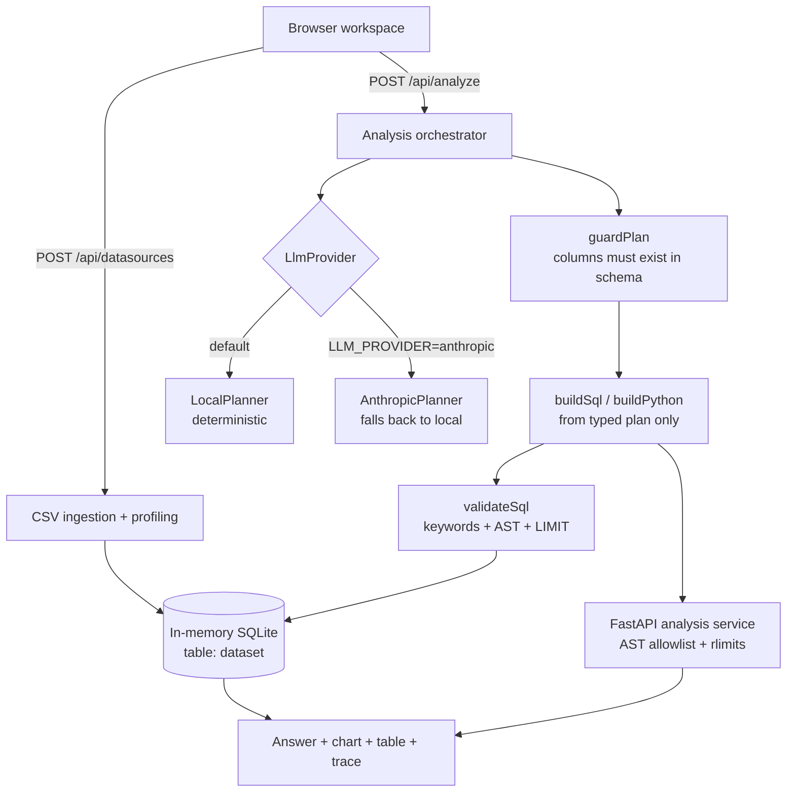

# InsightLab — AI Data Analyst

**Ask questions. Understand your data. Make better decisions.**

> InsightLab is an AI-assisted data-analysis application that lets users upload CSV datasets, ask
> questions in natural language, inspect generated SQL and Python, and explore computed results
> through interactive visualizations. It demonstrates schema-driven planning, tool-oriented
> analysis, read-only SQL validation, data-quality profiling, restricted Python execution, and
> reproducible analytics workflows.

Status: **portfolio-quality v0.1.0**, not production-ready. See `PORTFOLIO_STATUS.md` and
`RELEASE_NOTES.md` for exactly what has been verified by execution and what has not.

Upload a CSV or load a deterministic demo dataset, ask questions in plain English, and get an
answer backed by generated read-only SQL, generated Pandas code, a chart, a results table, stated
assumptions, and a full execution trace. Nothing in the answer is hardcoded: every number comes
from a query executed against the dataset you loaded.

---

## Features

| Area | What it does |
|---|---|
| Data sources | CSV upload (delimiter/header/type detection) and a seeded demo dataset, both loaded into in-memory SQLite |
| Profiling | Per-column type inference, null counts, uniqueness, min/max/mean, and data-quality warnings |
| Agent | Structured planning → typed operation → SQL/Python generation → validation → execution → hedged explanation |
| SQL safety | Keyword validator + AST parser, statement-stacking and comment-bypass rejection, mandatory LIMIT, `query_only` connection |
| Python safety | AST allowlist validation, forked child process, `setrlimit`, cleared environment, reduced builtins, output caps |
| Transparency | Answer, chart, table, SQL, Python, plan JSON, and a per-tool timing trace are all inspectable |
| Reproducibility | Deterministic demo data + visible SQL/Python + downloadable CSV/JSON results |

## Architecture



### Agent workflow

1. `get_dataset_schema` / `get_column_profile` / `get_sample_rows` — inspect the real dataset.
2. `create_analysis_plan` — the provider returns an `AnalysisPlan` containing a **typed
   `operation`** (`trend` | `group` | `share` | `correlation` | `quality` | `none`).
3. `guard_plan` — every column the plan names must exist in the schema, otherwise the analysis is
   downgraded to *unsupported*. This is what makes a model-authored plan safe to execute.
4. `buildSql` / `buildPython` — SQL is assembled from the typed operation with quoted identifiers.
   **User text never reaches the query string.**
5. `validate_sql` → `execute_read_only_sql` → optional `execute_python_analysis`.
6. `validate_output` — checks finiteness, truncation, and that the chart config matches the columns
   actually returned.
7. Explanation — observations, hypotheses, assumptions and limitations are kept distinct.

### Tools

| Tool | Location |
|---|---|
| `get_dataset_schema` | `DataSource.schema()` |
| `get_column_profile` | `DataSource.profile()` |
| `get_sample_rows` | `DataSource.sample()` |
| `validate_sql` | `src/lib/sql-validator.ts` |
| `execute_read_only_sql` | `SqliteDataSource.executeReadOnlyQuery()` |
| `execute_python_analysis` | `services/analysis` (`POST /execute`) |
| `create_chart` | `buildChart()` in `src/lib/agent/orchestrator.ts` |
| `export_analysis` | `POST /api/export` |

### Data-source model

`src/lib/datasource/index.ts` defines the `DataSource` interface. `SqliteDataSource` implements it
for CSV and demo data. The agent depends only on the interface, so a `PostgresDataSource` needs a
new file implementing the same methods — no planner, validator, or orchestrator changes.

### SQL safety model

Four independent layers: (1) SQL is built from a typed plan, never string-concatenated from user
input; (2) `validateSql` strips comments, rejects stacked statements, rejects mutating/DDL/file
keywords, requires a leading `SELECT`/`WITH`, and appends a `LIMIT`; (3) `node-sql-parser` confirms
the AST is a single SELECT; (4) the connection runs with `PRAGMA query_only = true`, so a write that
somehow got through would still fail at the driver.

### Python sandbox model

`validator.py` walks the AST and rejects anything outside an allowlist (`pandas`, `numpy`, `math`,
`statistics`, `datetime`, `json`), plus all dunder access and `eval`/`exec`/`open`/`getattr`.
`runner.py` then forks a child that applies `RLIMIT_CPU`, `RLIMIT_AS`, `RLIMIT_NPROC=0` (no
fork/subprocess) and `RLIMIT_FSIZE=0`, clears `os.environ`, and executes with a reduced builtins
mapping exposing only `pd`, `np`, `df`. Results are serialised to JSON and row-capped.

---

## Local setup

```bash
git clone <your-fork> insightlab && cd insightlab
cp .env.example .env
npm ci
npm run dev            # http://localhost:3000
```

Optional Python analysis service (in a second terminal):

```bash
cd services/analysis
python3 -m venv .venv && source .venv/bin/activate
pip install -r requirements.txt
uvicorn main:app --host 127.0.0.1 --port 8000
```

Or both at once:

```bash
docker compose up --build
```

### Environment variables

| Variable | Default | Meaning |
|---|---|---|
| `LLM_PROVIDER` | `local` | `local` (deterministic, offline) or `anthropic` |
| `ANTHROPIC_API_KEY` | — | Server-side only. Never sent to the browser |
| `LLM_MODEL` | `claude-sonnet-4-6` | Model for the Anthropic adapter |
| `PYTHON_SERVICE_URL` | — | Unset ⇒ Python is generated but not validated or executed locally |
| `MAX_UPLOAD_BYTES` | `5242880` | Upload cap |
| `MAX_QUERY_ROWS` | `1000` | Row cap applied as a mandatory `LIMIT` |
| `QUERY_TIMEOUT_MS` | `10000` | SQL time budget |
| `PYTHON_TIMEOUT_MS` | `15000` | Sandbox deadline |
| `LLM_TIMEOUT_MS` | `20000` | Anthropic request deadline before deterministic fallback |

CSV headers must use letters, numbers, underscores, and spaces; the first character must be a letter or underscore. Unsupported header characters are rejected before the dataset is created so they cannot fail later during SQL generation.

Use `127.0.0.1`, not `localhost`, for `PYTHON_SERVICE_URL`: Node resolves `localhost` to `::1`
first while uvicorn binds IPv4, which fails silently.

### Demo

Click **Load demo dataset** — 270 days of seeded e-commerce orders (~810 rows, 12 columns),
identical on every run, including ~3% missing regions so the data-quality path is visible.

### Demo questions

These work against the demo dataset and each exercises a different path:

1. *How has revenue changed over time?* — monthly SQL aggregation + line chart.
2. *Which category has the highest profit?* — grouped ranking + bar chart.
3. *Which columns have the most missing data?* — profiling path, no SQL.

Also worth trying: *What are the strongest correlations between numeric variables?* (correlation
table), *Which is best?* (asks which metric you mean), and *What is the weather forecast for Tirana?*
(refuses instead of inventing an answer).

### Test commands

```bash
npm run typecheck                           # tsc --noEmit
npm test                                    # Vitest — 54 tests
npm run build                               # production build
npm start & npm run smoke                   # 18 HTTP checks against a running server
npm run test:e2e                            # Playwright (run `npx playwright install chromium` first)
cd services/analysis && pytest tests -q     # Pytest — 18 tests
```

`npm run smoke` covers demo load, CSV upload and profiling, a real analysis, five unsafe-SQL
rejections, the row limit, an empty result, an off-topic refusal, a clarification, prompt injection
inside cell values, an unknown session, and request-body validation.

Continuous integration runs type checking, unit tests, the production build, and Python tests on every push and pull request.

## Honest limitations

Full list in `PORTFOLIO_STATUS.md`. The short version:

- The Python sandbox is language-level, not kernel-level. Do not expose the service publicly.
- SQL timeouts are enforced after the statement returns (better-sqlite3 is synchronous, with no
  interrupt handle). Work is bounded up front by the mandatory `LIMIT`.
- Sessions live in process memory with a TTL, so datasets vanish on restart and do not scale past
  one instance.
- There is no authentication and no per-user ownership check.
- PostgreSQL and MySQL adapters do not exist yet; the interface is ready for them.
- Charts cover line and bar only.
- The `AnthropicPlanner` adapter has never been executed against the live API.

## Deployment notes

The web app needs a Node runtime (not edge) because `better-sqlite3` is native. The analysis service
should never be exposed publicly — keep it on an internal network as in `docker-compose.yml`, and
run it under gVisor or a per-request microVM for untrusted input.

## Roadmap

1. Authentication plus per-session ownership checks — required before any deployment.
2. SQL execution in a `worker_thread` so queries can be cancelled rather than timed after the fact.
3. A `PostgresDataSource` behind the existing interface, proving the abstraction holds.
4. Run the Playwright suite in CI with browsers installed.
5. Exercise the `AnthropicPlanner` against the live API and assert `guardPlan` rejects hallucinated
   columns.
6. Streaming stage updates over SSE; saved insights with persistence; scatter/histogram/box/heatmap
   charts.

## License

MIT — see `LICENSE`.
